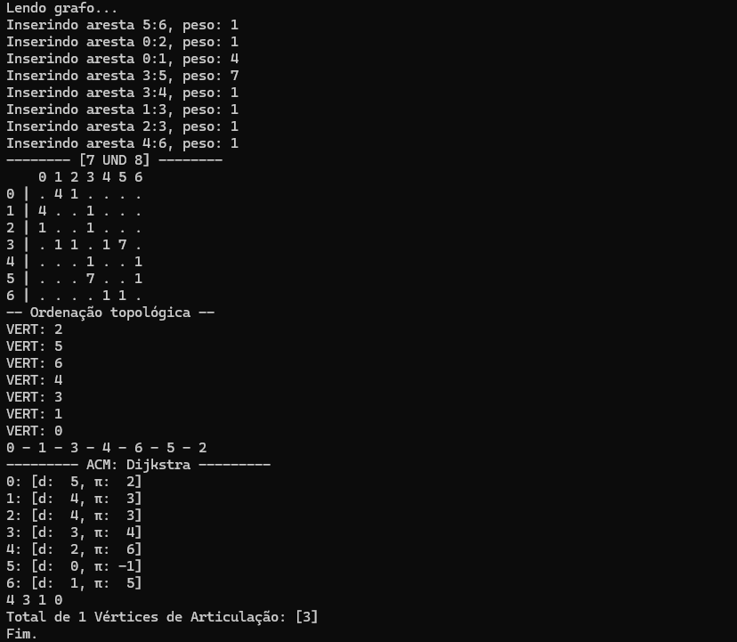

# Algoritmos e Simulações de Grafos de AED-II / EP1

O projeto atual implementa em C vários algoritmos e funções que manipulam grafos visando o estudo desses algoritmos. Vários desses algoritmos são fundamentais para a construção do EP1.
Os algoritmos e estruturas lidam tanto com grafos direcionados quanto não direcionados.

Algoritmos implementados:
* Construção de grafo por arquivo de definições
* Busca em profundidade
* Busca em largura
* Caminhos mais curtos
* Identificação de grafos cíclicos
* Componentes conectados
* Ordenação topológica
* Árvore geradora mínima (Alg. de Prim)
* Árvore de caminhos mínimos (Alg. de Dijkstra)
* Estruturas Union-find
* Identificação de vértices de articulação (implementação trivial)

Também estão inclusas funções básicas de manipulação de grafos:
- Inserção de aresta
- Remoção de aresta
- Iteração da lista de adjacência
- Manipulação do peso de aresta
- Transposição do grafo
- Clonagem do grafo
- Remoção de vértice

## Uso
O programa executa por padrão testes nos algoritmos utilizando alguns exemplos de entrada disponíveis nas pastas "grafos" e "testes". Os testes realizados no código estão disponíveis na entrada principal em testa_grafo.c e podem ser configurados ali mesmo.

## Exemplo de Saída


## Estrutura do diretório
|Nome|Função|
|-|-|
|alg/|Cabeçalhos e implementações dos algoritmos principais listados acima|
|estr/|Estruturas auxiliares, como vetores, filas, listas, heaps, etc.|
|testes/|Entradas e saídas testes principais do EP1|
|grafos/|Arquivos de definição de grafo a serem utilizados para testar os algoritmos|
|obj/|Pasta de saída dos objetos compilados|
|testa_grafo.c|Entrada principal da suíte de testes|
|Makefile|Definição do sistema de build do projeto|

## Compilação
Para compilar os testes, deve-se utilizar o Makefile do projeto com uma das targets abaixo:
```
lis: Compila os testes utilizando a implementação por lista de adjacência como base.
mat: Compila os testes utilizando a implementação por matriz de adjacência como base.
clean: Limpa os arquivos da pasta de build e o executável final.
```
**Nota Importante!**: O comando ```make clean``` sempre deverá ser utilizado ao transicionar de ```make mat``` para ```make lis```. Caso contrário, a linkagem final será feita errada e o programa apresentará comportamento indefinido.

A escolha entre grafos direcionados ou não direcionados pode ser feita no Makefile alterando a flag do compilador ```-DGRAFO_DIRECIONADO=X```, onde 1 opta por grafos direcionados.
