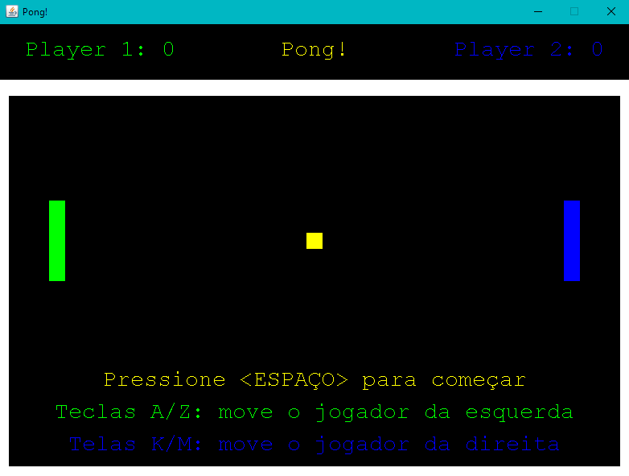

# Exercício Programa 1 - COO
EP1 da matéria de Computação Orientada a Objetos, ministrada pelo professor Daniel Cordeiro no terceiro semestre.

O EP se trata de completar a implementação de um jogo de Pong em Java.



## :file_folder: Estrutura
|Diretório|Função|
|-|-|
|lib|Contém os **.class** distribuídos já com o EP, e o javadoc distribuído. Também contém o **GameLib.jar**, que contém todas os arquivos .class além do javadoc embutido. As targets _build_ e _run_ do **Makefile** dependem exclusivamente de GameLib.jar. Os arquivos .class distribuídos são utilizados somente na construção do GameLib.jar.|
|src|Armazena o código fonte (**.java**) das classes implementadas pelo aluno.|
|output|Saída dos arquivos **.class** compilados da fonte em src/.|

## :package: Compilação
:cowboy_hat_face: **tl;dr** ```> make build```

O EP é distribuído com todas classes já compiladas em arquivos **.class**, além de um diretório **javadoc/** contendo a documentação de cada classe. Esses arquivos são encontrados assim como vieram nos diretórios ```lib/classes/``` e ```lib/javadoc/``` respectivamente.

O **.zip** distribuído inclui **Player.class**, **Score.class** e **Ball.class**, que são os compilados iniciais das classes. Esses  3 arquivos **não** estão presentes no diretório ```lib/classes/```, pois serão gerados pelo próprio projeto.

Para auxiliar no desenvolvimento e na depuração do projeto, os diretórios ```lib/classes``` e ```lib/javadoc``` são compilados em um único arquivo Java Archive (.jar), encontrado em ```lib/GameLib.jar```. Os arquivos .jar geralmente são suportados de melhor forma nas IDEs modernas. A compilação desse .jar pode ser invocada usando o makefile com o comando ```> make gamelib```. Esse passo não é necessário para executar o projeto pois o GameLib.jar já vem distribuído aqui nesse repositório, mas é importante documentar sua origem.

Para compilar as fontes das classes Java presentes em ```src/```, invoque o comando ```> make build```, que gerará os arquivos **.class** no diretório ```output/```

## :arrow_forward: Executando
🤠 **tl;dr:** ```> make run``` 

Para executar o EP, deve-se executar as classes compiladas da fonte em conjunto com as classes distribuídas. O ponto de entrada main() do projeto se encontra na classe distribuída **Pong.class**.

O Makefile distribuído já possui uma _target_ que compila e logo executa o projeto, usando o comando: ```> make run```

Se desejar executar sem usar o Makefile, deve-se identificar ao Java o diretório das classes compiladas pelo usuário e as classes distribuídas, usando o _switch --class-path_ do Java.

**Exemplo 1:** Executando usando as classes compiladas no GameLib.jar

```> java --class-path "output;lib/GameLib.jar;" Pong```

**Exemplo 2:** Executando usando as classes compiladas em lib/classes/

```> java --class-path "output;lib/classes;" Pong```