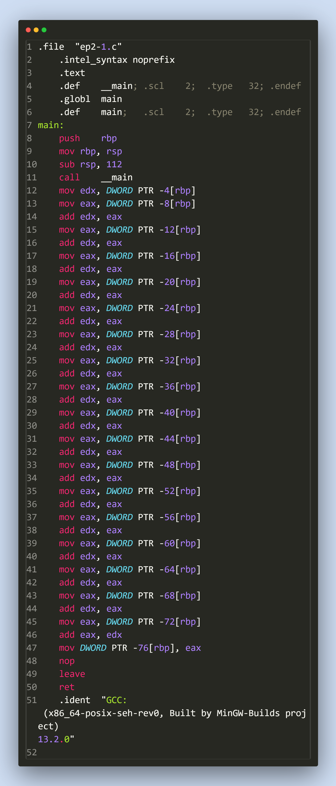
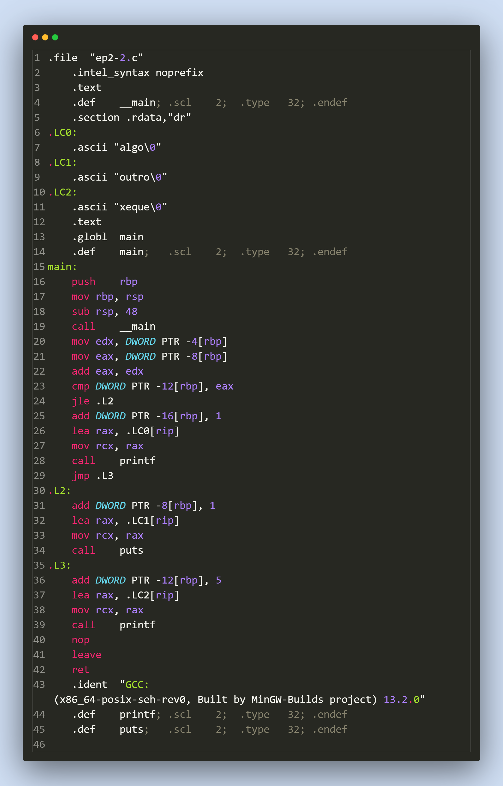
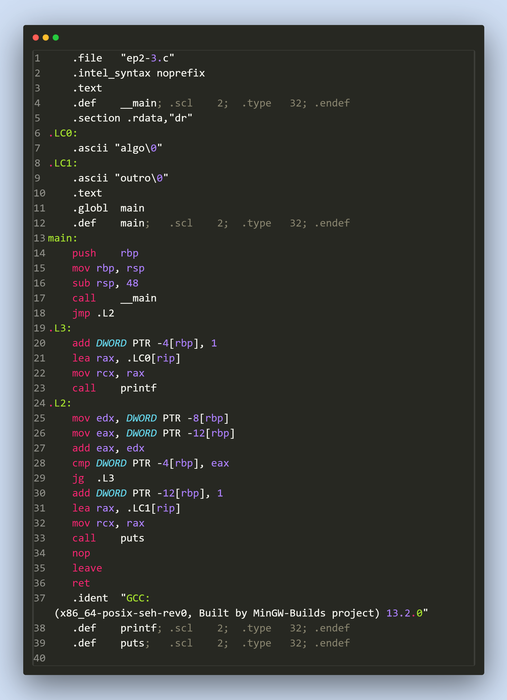

# EP2 - Análise do Assembly de Saída

Relatório sobre o assembly gerado de três programas exemplos em C. O relatório foi escrito em Markdown e impresso com auxílio da ferramenta online gratuita **StackEdit**.

## :package: Compilação
Para analisar os arquivos .s, compilamos o arquivo fonte .c com algumas diretivas.

```gcc -S ep2-N.c -masm=intel -fno-asynchronous-unwind-tables -O0 -g0```

Cada uma dessas diretivas controla a geração do assembly, a notar:

|Diretiva|Funcionalidade|
|--:|:--|
-S|Pede ao compilador que apenas gere o assembly para o arquivo dado, e não prossiga com os passos do Assembler e do Linker.
-masm=intel|Gera o assembly em sintaxe Intel ao invés da sintaxe padrão GAS. A sintaxe Intel costuma ser visualmente mais limpa.
-fno-asynchronous-unwind-tables|Remove do Assembly final diretivas responsáveis por lidar com o unwind da pilha no caso de exceções. Como não estamos usando exceções no código, remove um pouco do barulho do código.
-O0|Desativa todas as otimizações, tornando o código gerado mais próximo do código em C.
-g0|Desativa o suporte para depuração, também tornando o código mais direto e mais fácil compreensão.

## :exclamation: Importante
Enalteço aqui que: Ao primeiro arquivo darei um tratamento especial, e escreverei a explicação em vários detalhes para todas linhas e diretivas que surgirem. Dito isso, os outros dois arquivos que analisaremos possuem muitas das mesmas diretivas e formatações, e portanto, para não termos muita redundância, serei progressivamente mais breve neles.

## :scroll: Arquivo EP2-1.s


As linhas 1-6 são diretivas para o Assembler que especifica algumas informações importantes.

```1] .file "ep2-1.c"``` - Informa ao assembler de onde esse Assembly veio. No caso do código assembly possuir erros, o Assembler usará essa informação para gerar mensagens de erro mais úteis.

```2] .intel_syntax noprefix``` - Remove os marcadores especiais $, @ da sintaxe gerada. (Consequência de termos pedido para gerar código em sintaxe Intel)

```3] .text``` - Pede ao assembler que a partir desse momento, os códigos e símbolos abaixo devem ser emitidos na seção TEXT do objeto final. A seção TEXT justamente é responsável por armazenar o código binário do executável.

```
4] .def __main ; ...
6] .def main ; ...
```
Fornecem ao depurador informações sobre os símbolos presentes no assembly. Essas informações geralmente são colocadas numa seção especial do objeto final se o modo depuração do compilador estiver ligado, se a depuração estiver desligada, essas diretivas são ignoradas.

```5] .globl main``` - Sinaliza que a label main (declarada logo abaixo) será um símbolo global, e sua posição deve ser visível no objeto resultante e no executável final. Deve também ser _linkável_ na definição de outros símbolos.

```7] main:``` - Indica ao assembler que nesse ponto do objeto há um _label_, a partir desse momento, qualquer instrução ou diretiva de armazenamento colocará informações sob o nome desse _label_. Se o _label_ for usado para posicionar instruções, isso significa que esse _label_ pode ser usado como uma função, e pode ser o alvo dos mnemônicos call e da família de instruções jmp.

```
 8] push rbp
 9] mov rbp, rsp
10] sub rsp, 112
```

Essas instruções são melhores entendidas juntas. Elas compõem o que geralmente chamamos de **prólogo** de uma funcão. Salvo caso especiais e otimizações, toda função aparecerá com um prólogo aproximadamente nesse formato.

A primeira instrução salva na pilha o registrador RBP. A função que chamou essa precisará de RBP intacto quando a função atual retornar, portanto, precisamos preservar na pilha o RBP original.

A segunda instrução faz RBP = RSP, ou seja, faz RBP apontar para a base da pilha. O registrador RBP será usado para acessar variáveis locais e parâmetros a partir de um ponto de referência fixo na pilha. 

A última instrução subtrai 112 bytes do ponteiro de pilha. Na arquitetura x86, a pilha cresce para baixo. Portanto, decrementar o ponteiro de pilha possui o efeito de alocar espaço na pilha de execução para variáveis locais, que serão intocadas no caso de chamarmos subrotinas.

```11] call __main``` - Invoca a inicialização providenciada pela biblioteca C. Após essa chamada, começa efetivamente a execução do código em C presente no main.

```12] mov edx, DWORD PTR -4[rbp]``` - Usa o ponteiro para a base da pilha, desloca-o por 4 bytes, lê um inteiro de 32 bits e o coloca no registrador EDX. Essa instrução acessa a variável local mais próxima da base da pilha, que no caso costuma ser a primeira a ser declarada (int a), e a coloca em EDX. As instruções subsequentes acessarão as outras variáveis, e as acumularão em EDX.

:exclamation: Importante dizer que essa leitura, assim como todas as outras leituras subsequentes estão acessando valores não inicializados da pilha, e portanto, são valores indefinidos.

```13] mov eax, DWORD PTR -8[rbp]``` - Lê um inteiro de 32 bits 8 bytes acima da base da pilha e o coloca no registrador EAX. Essa é a segunda variável local (int b).

```14] add edx, eax``` - Soma a EDX o valor contido em EAX. O efeito é somar as duas primeiras variáveis locais e tê-las em EDX.

```15 - 45] ``` - A partir desse momento, as instruções da linha 13 e 14 se repetem várias vezes, apenas mudando o deslocamento da base da pilha. As variáveis locais foram alocadas na pilha sequencialmente a partir da base, e portanto, o assembly final acessa uma a uma usando deslocamentos múltiplos de 4, pois cada variável é um int 32 bits. Cada acesso lê a variável em EAX e depois a soma com o que já está em EDX. Acumulando todos os valores assim como aparece no código em C.

```46] add eax, edx``` - A última soma inverte os operandos de forma que a soma final de todos os números caia em EAX.

```47] mov DWORD PTR -76[rbp], eax``` - Salva na última variável local (int s) da pilha o resultado da soma de todos os números.

```48] nop``` - Não faz nada. Provavelmente aqui por razões de alinhamento da pilha de execução.

```
49] leave
50] ret
```
Epílogo da função. A primeira instrução desaloca toda as variáveis locais e restaura o ponteiro de pilha EBP original (antes de entrarmos nessa função.)
A segunda instrução retorna a execução dessa função de volta para aquela que a chamou.```

```51] .ident "..."``` - Marcador de comentário criado pelo compilador. Os comentários vão parar em uma seção especial de comentários do objeto final.

## :scroll: Arquivo EP2-2.s



As linhas 1-4 são todas diretivas para o Assembler que já vimos antes.

```1] .file "ep2-2.c"``` - Informa que o assembly gerado veio de ep2-2.c;

```2] .intel_syntax noprefix``` - Habilita a sintaxe intel de assembly.

```3] .text``` - Ativa a emissão de símbolos na seção de texto do arquivo objeto

```4] .def __main ; ...``` - Declara no objeto a presença do símbolo __main(). Essa informação pode ser usada num depurador.

```5] .section .rdata,"dr"``` - Muda a emissão de símbolos para uma nova seção chamada ".rdata", com flags D (data) e R (read-only). Essa seção conterá apenas dados não executáveis e constantes. O nome .rdata, assim como o nome .text são na verdade convenções de nomes das seções do programa. O Loader do sistema não liga para o nome de cada seção contanto que elas possuam as características e flags necessárias.
A presença dessa diretiva nos indica que abaixo dela virão constantes do programa.

```
6] .LC0:
7] 		.ascii "algo\0"
```

A primeira linha indica uma label como visto anteriormente. Mas nesse caso, essa label está sendo usada para salvar a posição de uma constante na memória. O programa utilizará a label (.LC0 -- Local Constant 0) para acessar posteriormente essa string constante na memória.

A segunda linha armazena diretamente na seção de dados (como pedido) a string terminada em nulo "algo".

```
 8] .LC1:
 9] 	.ascii "outro\0"
10] .LC2:
11]		.ascii "xeque\0"
```

Novamente, mais duas strings são armazenadas nos dados contantes. A string "outro" acessível através do label .LC1, e a string "xeque" acessível pelo label .LC2.
Veja que os nomes das labels não importam muito, e são apenas auto-incrementadas pelo compilador conforme necessário.

```12] .text``` - Volta a emitir símbolos na seção texto de código do objeto.

```13] .globl main``` - Sinaliza que a label main será um símbolo global e sua posição será no executável final. 

```14] .def main; ...``` - Informações sobre esse símbolo para o depurador.

```15] main:``` - Começo da definição do código assembly da função main().

```
16] push rbp
17] mov rbp, rsp
18] sub rsp, 48
```

Prólogo da função main(). Como descrito anteriormente, salva o ponteiro da base da pilha, cria uma nova base de pilha e aloca espaço para as variáveis locais. Nesse caso, 48 bytes de espaço são reservados para as variáveis locais na pilha.

```19] call __main``` - Inicialização da biblioteca padrão.

```
20] mov edx, DWORD PTR -4[rbp]
21] mov eax, DWORD PTR -8[rbp]
22] add eax, edx
```

Lê respectivamente a primeira e a segunda variável de 32 bits da pilha e as coloca em EDX e EAX. Essas variáveis correspondem as variáveis B e C do código original.
Em seguida, soma os dois conteúdos com o resultado final em EAX.

EAX = EAX(int b) + EDX(int c)

```
23] cmp DWORD PTR -12[rbp], eax
```

Faz uma comparação da 3ª variável na pilha (int a) com a soma que calculamos anteriormente. O resultado dessa comparação alterará as flags do processador e setará bits de sinal.

```
24] jle .L2
```

Pula a execução para a label .L2 se a comparação anterior resultou no primeiro operando menor ou igual (Less or Equal) do que o segundo. Esse jump condicional executa o ELSE do IF.

```
25] add DWORD PTR -16[rbp], 1
```

Se o pulo anterior não foi feito, então caímos na condição do if que era (a > (b + c)). Nessa linha agora, somamos à quarta variável de 32 bits (int d) um acréscimo de 1.

```
26] lea rax, .LC0[rip]
27] mov rcx, rax
28] call printf
```

Essas 3 instruções performam a chamada do printf("algo").
Primeiro, coloca-se no registrador 64 bits RAX o endereço da string .LC0 ("algo") declarada anteriormente. Depois, esse endereço é colocado em RCX.
Ao fim, a chamada para função printf() é feita.

Essa movimentação RCX = RAX é realizada pois o nosso compilador (MinGW) segue a convenção de chamadas de 64 bits da Microsoft, assim como o compilador MSVC. Nessa convenção, uma das estipulações é que o primeiro parâmetro da função chamada deve ser colocado no registrador RCX.

``` 29] jmp .L3 ``` - Pula para a label .L3, essencialmente terminando o IF.

```30] .L2:``` - Definição da label L2. Aqui ficou os códigos para o braço ELSE do IF.

```31] add DWORD PTR -8[rbp], 1``` - Soma 1 a variável local c (int c)

```
32] lea rax, .LC1[rip]
33] mov rcx, rax
34] call puts
```

Preparação e chamada da função C puts(). Coloca em RAX o endereço da string em .L1 ("outro"), movimenta RCX = RAX e chama puts(). Novamente, RCX está sendo usado para guardar o primeiro parâmetro dessa chamada.

```35] .L3:``` - Label utilizada para o fim do if.

```36] add DWORD PTR -12[rbp], 5``` - Soma 5 a variável local a (int a)

```
37] lea rax, .LC2[rip]
38] mov rcx, rax
39] call printf
```

Chamada do printf("xeque"), com a string armazenada em .LC2, como explicado anteriormente.

```40] nop``` - Não faz nada.

```
41] leave
42] ret
```
Epílogo da função. Desaloca o espaço das variáveis locais, restaura o ponteiro de pilha original RBP e sai da função main().

## :scroll: Arquivo EP2-3.s


```1] .file "ep2-3.c" ``` - Indica a origem desse assembly.
```2] .intel-syntax noprefix``` - Ajusta a sintaxe do assembly gerado.
```
3] .text
4] .def __main
```
Mira na seção texto do objeto e define __main como um símbolo participante dessa seção para o depurador.
```
5] .section .rdata,"dr"
6] .LC0:
7] 		.ascii "algo\0"
8] .LC1:
9] 		.ascii "outro\0"
```
Troca o alvo do assembler para a seção de dados apenas leitura do objeto (.rdata) e gera dois símbolos para duas strings terminadas em nulo: .LC0 para a string "algo" e .LC1 para a string "outro". Essas labels são usadas depois no programa para imprimir essas strings.

```
10] .text
11] .globl main
12] .def main; ...
13] main:
```
Muda novamente o alvo do assembler para a seção texto. Declara que o label main: será um label global visível no objeto final, depois declara propriedades sobre main para a seção especial de depuração do objeto.
Ao final, começa a declaração dos conteúdos de main().

```
14] push rbp
15] mov rbp, rsp
16] sub rsp, 48
```
Prólogo da função main(), dessa vez alocando 48 bytes de espaço para as variáveis locais.

```17] call __main``` - Inicialização da biblioteca C.

```18] jmp .L2``` - Pula a execução para a label .L2. Essa label vai ser responsável por calcular a condição do while() e tem o resto do código depois do while().

```19] .L3:``` - Definição do label local .L3. Esse label ficou responsável pelo corpo do while(). Incluindo o acréscimo e o print().

```20] add DWORD PTR -4[rbp], 1``` - Soma 1 na primeira variável da pilha (int a).

```
21] lea rax, .LC0[rip] 
22] mov rcx, rax
23] call printf
```
Preparação e execução do printf("algo"). Como dito antes, .LC0 guarda a string "algo", e printf() espera o primeiro argumento do formato em RCX.

```24] .L2:``` - Definição de .L2: Ficou responsável pelo cálculo da condição do while, o pulo para o corpo se a condição for verdadeira, e o resto do programa.

```
25] mov edx, DWORD PTR -8[rbp]
26] mov eax, DWORD PTR -12[rbp]
27] add eax, edx
```
Lê a segunda e terceira variável inteira da pilha. Os equivalentes de (int b) e (int c). Logo em seguida, as soma com o resultado da soma final em EAX.

```
28] cmp DWORD PTR -4[rbp], eax
29] jg .L3
```
Compara a primeira variável da pilha (int a) com a soma que calcuamos em EAX (b + c). Em seguida, a partir do resultado dessa comparação, se o primeiro operando (a) for maior que o segundo (b + c), pula de volta para .L3, que contém o corpo do while.

```30] add DWORD PTR -12[rbp], 1``` - Soma 1 na terceira variável (int c). A partir dessa instrução, os comandos estão de fora do while.

```
31] lea rax, .LC1[rip] 
32] mov rcx, rax
33] call puts
```
Chamada do puts("outro"). Carrega em RAX o ponteiro para a string "outro" armazenada em .LC1, coloca o ponteiro em RCX, e chama puts() para imprimir a string.

```
34] nop
35] leave
36] ret
```
Epílogo da função, como visto mais vezes, desaloca as variáveis locais, restaura o ponteiro de base original (RBP) e retorna da função main().
