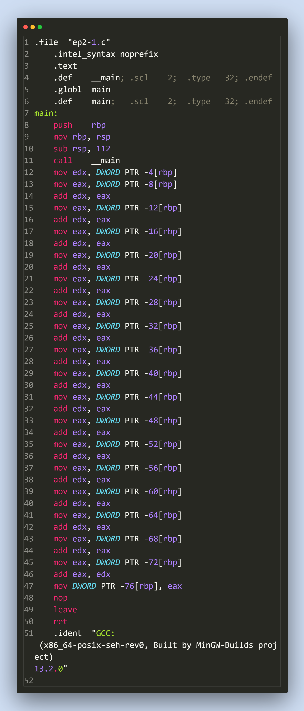

# Análise do Assembly de Saída
## :package: Compilação
Para analisar os arquivos .s, compilamos o arquivo fonte .c com algumas diretivas.

```gcc -S ep2-N.c -masm=intel -fno-asynchronous-unwind-tables -O0 -g0```

Cada uma dessas diretivas controla a geração do assembly, a notar:

Diretiva|Funcionalidade
--:|:--
-S|Pede ao compilador que apenas gere o assembly para o arquivo dado, e não prossiga com os passos do Assembler e do Linker.
-masm=intel|Gera o assembly em sintaxe Intel ao invés da sintaxe padrão GAS. A sintaxe Intel costuma ser visualmente mais limpa.
-fno-asynchronous-unwind-tables|Remove do Assembly final diretivas responsáveis por lidar com o unwind da pilha no caso de exceções. Como não estamos usando exceções no código, remove um pouco do barulho do código.
-O0|Desativa todas as otimizações, tornando o código gerado mais próximo do código em C.
-g0|Desativa o suporte para depuração, também tornando o código mais direto e mais fácil compreensão.

## :exclamation: Importante
Enalteço aqui que: Ao primeiro arquivo darei um tratamento especial, e escreverei a explicação em vários detalhes para todas linhas e diretivas que surgirem. Dito isso, os outros dois arquivos que analisaremos possuem muitas das mesmas diretivas e formatações, e portanto, para não termos muita redundância, serei mais breve neles.

## :scroll: Arquivo EP2-1.s
O assembly gerado final depois da compilação é este:



As linhas 1-6 são diretivas para o Assembler que especifica algumas informações importantes.

```1] .file "ep2-1.c"``` - Informa ao assembler de onde esse Assembly veio. No caso do código assembly possuir erros, o Assembler usará essa informação para gerar mensagens de erro mais úteis.
```2] .intel_syntax noprefix``` - Remove os marcadores especiais $, @ da sintaxe gerada. (Consequência de termos pedido para gerar código em sintaxe Intel)

```3] .text``` - Pede ao assembler que a partir desse momento, os códigos e símbolos abaixo devem ser emitidos na seção TEXT do objeto final. A seção TEXT justamente é responsável por armazenar o código binário do executável.

```
4] .def __main ; ...
6] .def main ; ...
```
Fornecem ao depurador informações sobre os símbolos presentes no assembly. Essas informações geralmente são colocadas numa seção especial do objeto final se o modo depuração do compilador estiver ligado, se a depuração estiver desligada, essas diretivas são ignoradas.

```5] .globl main``` - Sinaliza que a label main (declarada logo abaixo) será um símbolo global, e sua posição deve ser visível no objeto resultante e no executável final. Deve também ser _linkável_ na definição de outros símbolos.

```7] main:``` - Indica ao assembler que nesse ponto do objeto há um _label_, a partir desse momento, qualquer instrução ou diretiva de armazenamento colocará informações sob o nome desse _label_. Se o _label_ for usado para posicionar instruções, isso significa que esse _label_ pode ser usado como uma função, e pode ser o alvo dos mnemônicos call e da família de instruções jmp.

```
 8] push rbp
 9] mov rbp, rsp
10] sub rsp, 112
```

Essas instruções são melhores entendidas juntas. Elas compõem o que geralmente chamamos de **prólogo** de uma funcão. Salvo caso especiais e otimizações, toda função aparecerá com um prólogo aproximadamente nesse formato.

A primeira instrução salva na pilha o registrador RBP. A função que chamou essa precisará de RBP intacto quando a função atual retornar, portanto, precisamos preservar na pilha o RBP original.

A segunda instrução faz RBP = RSP, ou seja, faz RBP apontar para a base da pilha. O registrador RBP será usado para acessar variáveis locais e parâmetros a partir de um ponto de referência fixo na pilha. 

A última instrução subtrai 112 bytes do ponteiro de pilha. Na arquitetura x86, a pilha cresce para baixo. Portanto, decrementar o ponteiro de pilha possui o efeito de alocar espaço na pilha de execução para variáveis locais, que serão intocadas no caso de chamarmos subrotinas.

